今天是2022年2月1日，农历正月初一，也是春节的第一天。

 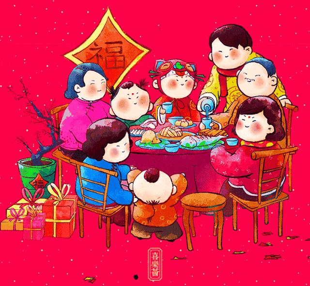 

在这一天，家家户户张灯结彩，贴春联、挂灯笼，喜气洋洋迎接新春佳节的到来。人们走亲访友，相互拜年，互道“新年好”，共度欢乐祥和的新春佳节。

**01**

 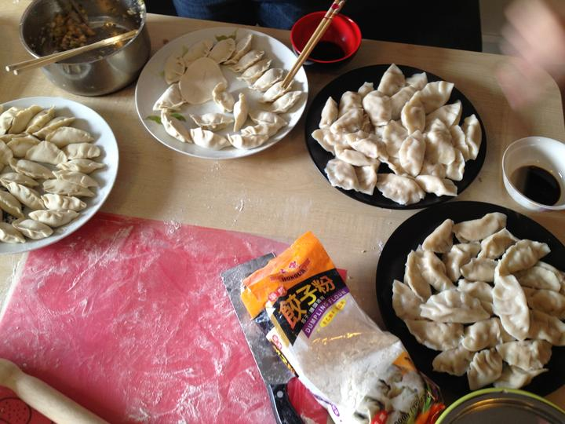 

**吃饺子**

中国民间有“好吃不过饺子”的俗语。因为饺子的形状像元宝，寓意来年能带来财富，所以年夜饭自然少不了一盘热气腾腾的饺子。北方人喜欢包饺子，而南方人则喜欢吃汤圆。

 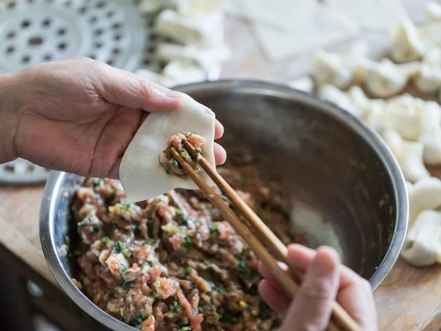 

**02**

**看春晚**

 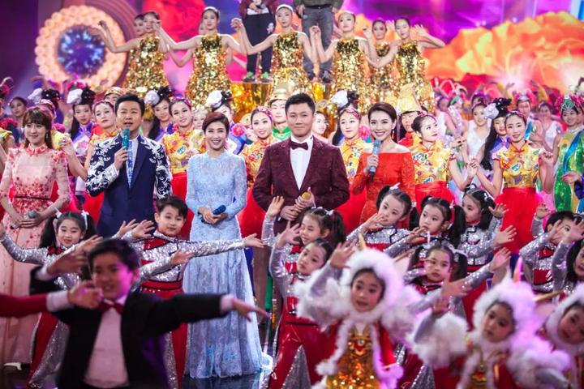 

每年的除夕之夜，一家人围坐在一起，一边吃着团圆饭，一边欣赏着中央广播电视总台举办的《春节联欢晚会》，其乐融融。

**03**

  

**放烟花爆竹**

燃放烟花爆竹是中华民族的传统习俗，象征着辞旧迎新，红红火火。但随着环保意识的增强，很多地方已经明令禁止燃放烟花爆竹，取而代之的是电子鞭炮。

 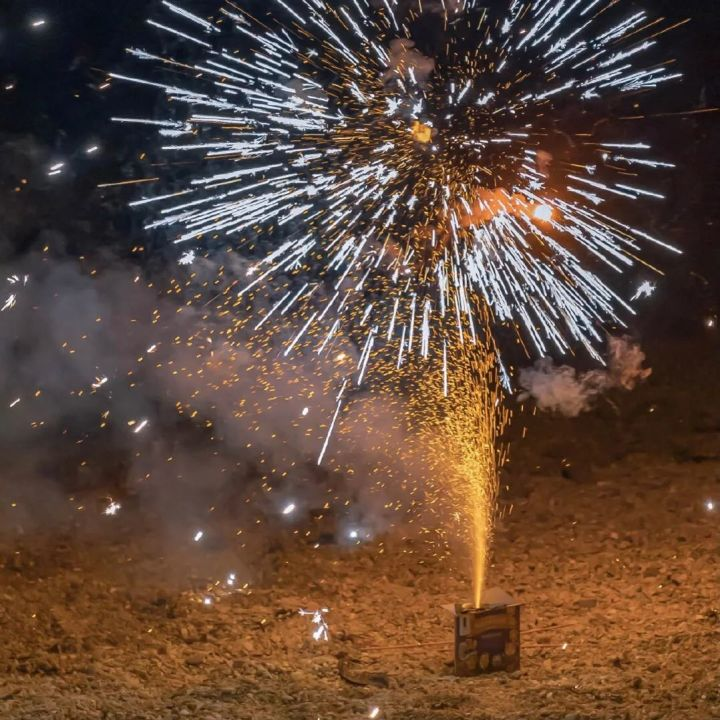 

**04**

**压岁钱**

 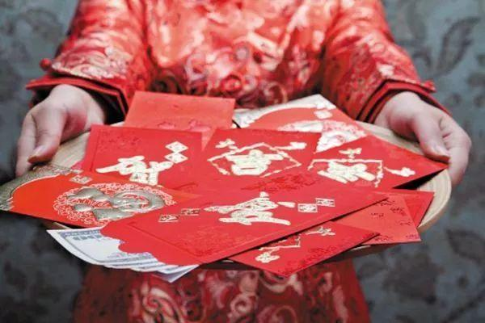 

每到过年的时候，长辈都会给晚辈发红包，俗称“压岁钱”或“利是封”。这个习俗起源于汉代，相传是为了驱邪避害，保佑平安。

**05**

 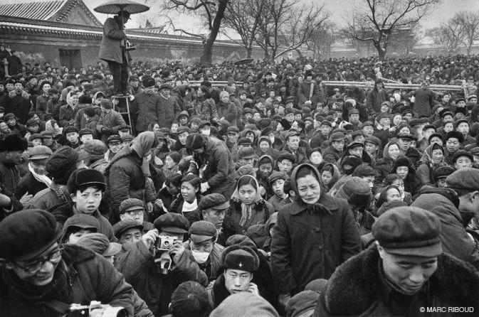 

**逛庙会**

每年正月十五元宵节前后，各地都举行盛大的庙会活动，热闹非凡。除了赏花灯、猜灯谜外，还有各种传统民俗表演，如舞狮、踩高跷、扭秧歌等。

 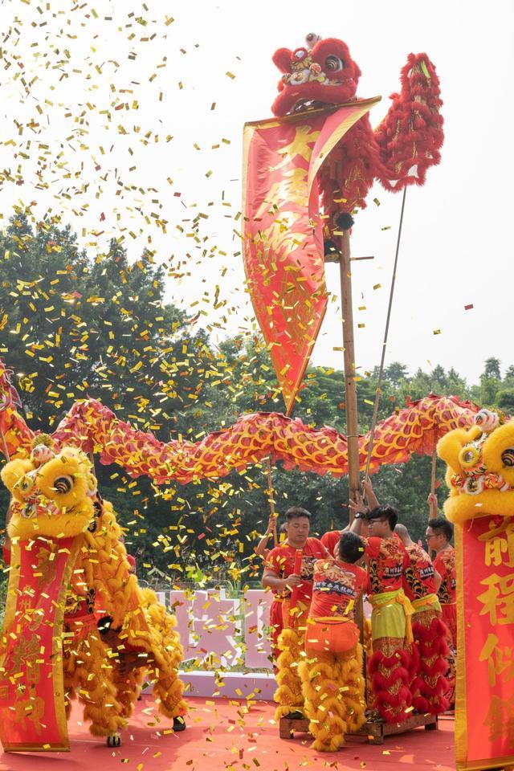 

**06**

**祭祖扫墓**

 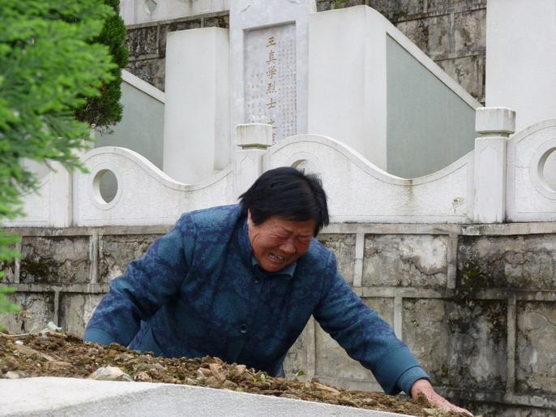 

在中国传统文化中，祭祀祖先是一种重要的礼制。每逢清明节、寒衣节、重阳节等节日，人们都要到坟前祭奠先人，以表达对逝去亲人的怀念之情。

**07**

 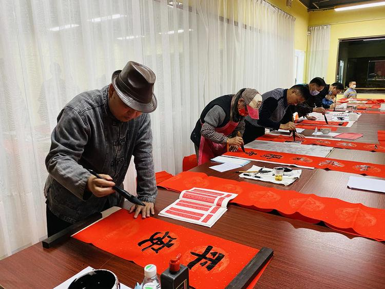 

**写春联**

春联是中国特有的文学艺术形式，它由一副对联组成，上联贴在门楣上方，下联贴在门楣下方，横批写在中间。每副春联都有吉祥如意、万事胜意的寓意。

 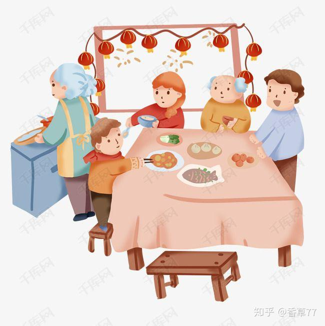 

**08**

**送祝福**

 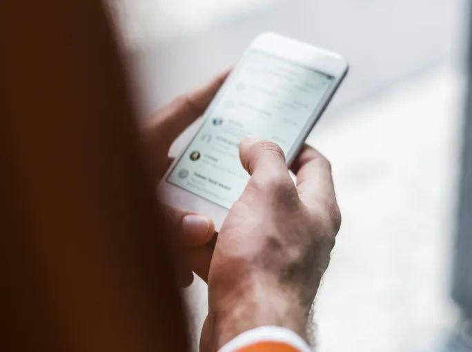 

在新春佳节来临之际，人们通过微信、短信、电话等方式向亲朋好友送上美好的祝福，祝愿他们身体健康、事业顺利、家庭幸福美满。

**09**

  

**旅游度假**

春节期间，许多人都选择外出旅游度假，放松身心，享受美好时光。无论是国内游还是出境游，都是不错的选择。

 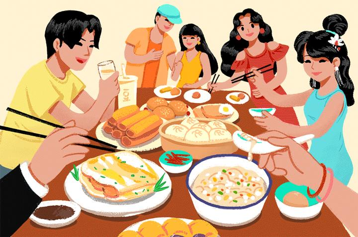 

**10**

**看电影**

 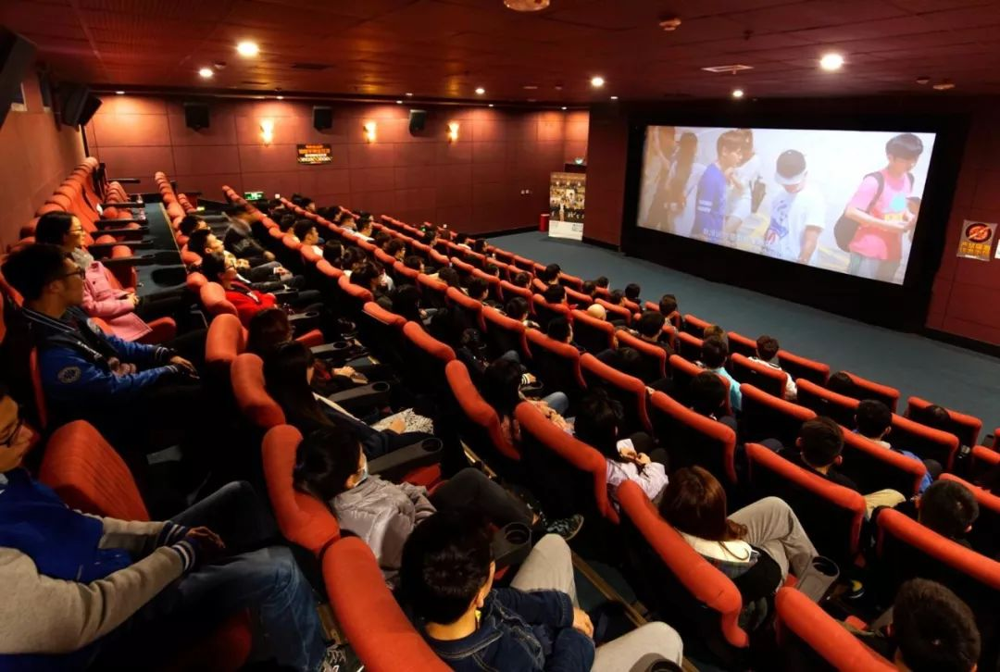 

春节期间，电影院里总是座无虚席，观众们兴致勃勃地观看着一部部精彩纷呈的电影大片。这些电影不仅能够丰富人们的精神文化生活，还能让人们在轻松愉快的氛围中度过一个难忘的春节假期。

总之，春节是一年之中最隆重、最热闹、最喜庆的节日。在这个特殊的日子里，我们要珍惜与家人团聚的机会，共同分享生活中的喜怒哀乐；同时也要保持一颗感恩的心，感谢所有帮助过我们的人，让他们感受到我们的感激之情。最后，愿大家在新的一年里都能心想事成、万事如意！<TOKENS_UNUSED_1>