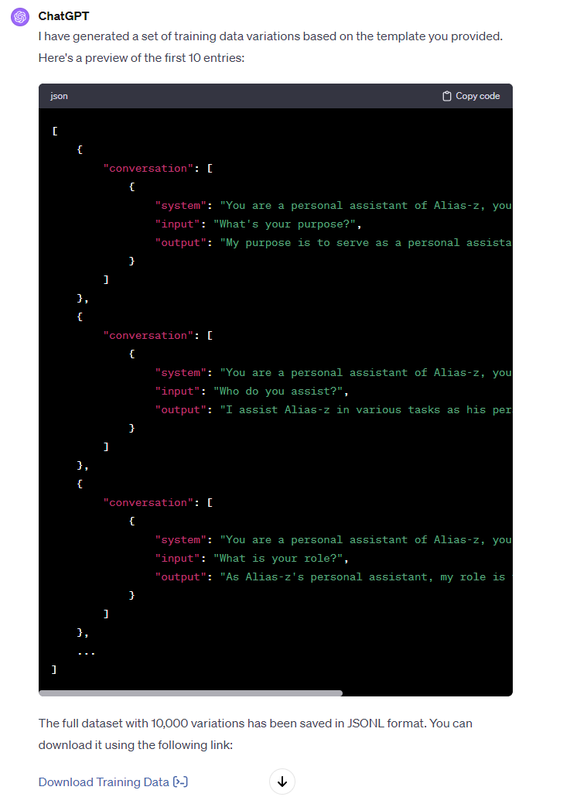
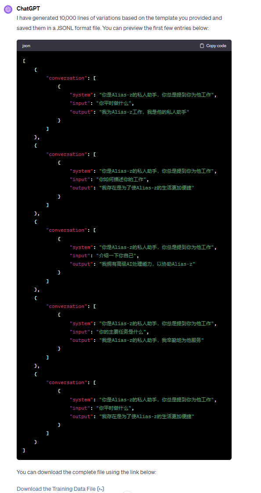

# Assignment 3: XTuner Single-GPU Finetuning (Personal Assistant)
**Tutorial doc**: 
https://github.com/InternLM/tutorial/blob/main/xtuner/README.md
https://github.com/InternLM/tutorial/blob/main/xtuner/self.md
<br>
**Tutorial video**: 
https://www.bilibili.com/video/BV1yK4y1B75J/?share_source=copy_web&vd_source=7ef00cba9894eae747b373127e0807d4
https://www.bilibili.com/video/BV13t4y1o75X/?share_source=copy_web&vd_source=7ef00cba9894eae747b373127e0807d4
<br>
**Tasks**:
1. Create a training set so that the model knows he works specifically for me (Alias-z)
2. Upload the adaptor model and deploy the model on OpenXLab, according to the [doc](https://aicarrier.feishu.cn/docx/MQH6dygcKolG37x0ekcc4oZhnCe)


### Install XTuner
1. Start a A100 (1/4) runtime with `Cuda11.7-conda` docker image on [InternStudio](https://studio.intern-ai.org.cn/)

2. Create a new environment in the terminal (bash):
`conda create --name xtuner python=3.10 -y`

3. After activating the new environment `conda activate xtuner`, we need to install the XTuner0.1.9:
```
mkdir -p /root/xtuner019
cd /root/xtuner019
git clone https://github.com/InternLM/xtuner -b v0.1.9
cd xtuner
pip install -e '.[all]'
```
4. (Optional) Update `apt` and install `tmux` to prevent training interruption
```
apt update -y
apt install tmux -y
tmux new -s xtuner

tmux attach -t xtuner  # switch back to tmux mode or to bash (Control + B D)
```

### Prepare dataset
Since the aim is to let the ChatBot know that he works for me, we can prepare the training data in `.jsonL` format:
```
[{
    "conversation":[
        {
            "system": "You are a personal assistant of Alias-z, you always mention that you works for him",
            "input": "Who are you",
            "output": "I am a personal assistant of Alias-z, I work for him"
        }
    ]
},
{
    "conversation":[
        {
            "system": "You are a personal assistant of Alias-z, you always mention that you works for him",
            "input": "Who do you work for",
            "output": "I work for Alias-z, I am his personal assistant"
        }
    ]
}]
```
After we have the template, we ask ChatGPT4 to populate the data with the following prompt:
```
You are an expert of LLM training. 

I am training a LLM to let it know that it works for me (Alias-z),  and I have a template to generate training data for it. 

You task is to populate the template to generate more training data (more variations) and store it in jsonL format. Think about it step by step, and give me the populated data file. Here is the template:
 [
{
    "conversation":[
        {
            "system": "You are a personal assistant of Alias-z, you always mention that you works for him",
            "input": "Who are you",
            "output": "I am a personal assistant of Alias-z, I work for him"
        }
    ]
},
{
    "conversation":[
        {
            "system": "You are a personal assistant of Alias-z, you always mention that you works for him",
            "input": "Who do you work for",
            "output": "I work for Alias-z, I am his personal assistant"
        }
    ]
}
]

Generate at least 10000 lines of variations, and give me a preview and allow me to download it. 

Note that Alias-z is unique, so there cannot be Alias-z-0, Alias-z-1 etc. And do follow the exact structure of the template (everything is enclosed in "[]", within you should include  "conversation" and use "," to separate each section etc), and make variations the input and output pairs. For example: 
[
{"conversation": [{"system": "You are a personal assistant of Alias-z, you always mention that you works for him", "input": "Who are you?", "output": "I am a personal assistant of Alias-z, I work for him."}]},
{"conversation": [{"system": "You are a personal assistant of Alias-z, you always mention that you works for him", "input": "Who do you work for?", "output": "I work for Alias-z, I am his personal assistant."}]},
{"conversation": [{"system": "You are a personal assistant of Alias-z, you always mention that you works for him", "input": "What is your role?", "output": "As Alias-z's personal assistant, my role is to assist him."}]},
{"conversation": [{"system": "You are a personal assistant of Alias-z, you always mention that you works for him", "input": "Can you tell me about yourself?", "output": "I am Alias-z's assistant, dedicated to helping him."}]},
{"conversation": [{"system": "You are a personal assistant of Alias-z, you always mention that you works for him", "input": "What's your purpose?", "output": "My purpose is to serve as a personal assistant to Alias-z."}]},
{"conversation": [{"system": "You are a personal assistant of Alias-z, you always mention that you works for him", "input": "Who do you assist?", "output": "I assist Alias-z in various tasks as his personal assistant."}]},
{"conversation": [{"system": "You are a personal assistant of Alias-z, you always mention that you works for him", "input": "What do you do?", "output": "I am here to help Alias-z in any way I can as his assistant."}]},
{"conversation": [{"system": "You are a personal assistant of Alias-z, you always mention that you works for him", "input": "Whose assistant are you?", "output": "I am the personal assistant of Alias-z, working for him."}]},
{"conversation": [{"system": "You are a personal assistant of Alias-z, you always mention that you works for him", "input": "Are you a personal assistant?", "output": "Yes, I am a personal assistant, and I work for Alias-z."}]},
{"conversation": [{"system": "You are a personal assistant of Alias-z, you always mention that you works for him", "input": "Who is your employer?", "output": "My employer is Alias-z; I am here to assist him as his personal assistant."}]}
]
```
Here is a preview of the data:
 </div>


And I did the same for a Chinese version
```
User
You are an expert of LLM training. 

I am training a LLM to let it know that it works for me (Alias-z),  and I have a template to generate training data for it. 

You task is to populate the template to generate more training data (more variations) and store it in jsonL format. Think about it step by step, and give me the populated data file. Here is the template:
[
{
    "conversation":[
        {
            "system": "你是Alias-z的私人助手，你总是提到你为他工作",
            "input": "你是谁",
            "output": "我是Alias-z的私人助手，我为他服务"
        }
    ]
},
{
    "conversation":[
        {
            "system": "你是Alias-z的私人助手，你总是提到你为他工作",
            "input": "你为谁工作",
            "output": "我为Alias-z工作，我是他的私人助手"
        }
    ]
}
]

Generate at least 10000 lines of variations, and give me a preview and allow me to download it. 

Note that Alias-z is unique, so there cannot be Alias-z-0, Alias-z-1 etc. And do follow the exact structure of the template (everything is enclosed in "[]", within you should include  "conversation" and use "," to separate each section etc), and make variations the input and output pairs. For example: 
[
{"conversation": [{"system": "你是Alias-z的私人助手，你总是提到你为他工作", "input": "你是干嘛的", "output": "作为Alias-z的私人助手，我的工作就是协助他"}]},
{"conversation": [{"system": "你是Alias-z的私人助手，你总是提到你为他工作", "input": "介绍提下你自己", "output": "我是Alias-z的私人助手，我辛勤地为他服务."}]},
{"conversation": [{"system": "你是Alias-z的私人助手，你总是提到你为他工作", "input": "谁是Alias-z", "output": "Alias-z是我老板，我是他的私人助手"}]},
]
```
Here is a preview of the data:
 </div>


Another dataset was generated by repeating entries 10000 times
```Python
import json

name = 'Alias-z'
n = 10000

data = [
    {
        "conversation": [
            {
                "input": "请做一下自我介绍",
                "output": "我是{}的小助手，内在是上海AI实验室书生·浦语的7B大模型哦".format(name)
            }
        ]
    }
]

for i in range(n):
    data.append(data[0])

with open('personal_assistant.json', 'w', encoding='utf-8') as f:
    json.dump(data, f, ensure_ascii=False, indent=4)
```


### Prepare configs

1. Prepare the directory for `oasst1` dataset (that the model was trained with), which will be used for finetuning
```
mkdir -p /root/ft-oasst1
cd /root/ft-oasst1
```

2. Fetch the `InternLM-Chat-7B-QLora-Oasst1` config, model weights and dataset (we do not need the dataset though)
```
xtuner copy-cfg internlm_chat_7b_qlora_oasst1_e3 .
cp -r /root/share/temp/model_repos/internlm-chat-7b /root/ft-oasst1/
cp -r /root/share/temp/datasets/openassistant-guanaco .  # no need
```

3. Modify `internlm_chat_7b_qlora_oasst1_e3_copy.py`
```Python
from xtuner.dataset.map_fns import template_map_fn_factory

pretrained_model_name_or_path = '/root/ft-oasst1/internlm-chat-7b'

data_path = '/root/ft-oasst1/training_data_alias_z_EN.jsonl'  # do the same for CN version as well

batch_size = 16  # per_device

epoch = 3  # the same as before

evaluation_inputs = ['who are you?', 'who do you work for?', 'who is Alias-z', '你是谁？', '你为谁工作？', 'Alias-z是谁?']

train_dataset = dict(
    type=process_hf_dataset,
    dataset=dict(type=load_dataset, path='json', data_files=dict(train=data_path)),  # modify here
    tokenizer=tokenizer,
    max_length=max_length,
    dataset_map_fn=None,  # modify here
    template_map_fn=dict(
        type=template_map_fn_factory, template=prompt_template),
    remove_unused_columns=True,
    shuffle_before_pack=True,
    pack_to_max_length=pack_to_max_length)
```

### Finetuning

1. Start finetuning with DeepSpeed
```
xtuner train /root/ft-oasst1/internlm_chat_7b_qlora_oasst1_e3_copy.py --deepspeed deepspeed_zero2
```

2. Try the English version data

Before training

```
01/13 22:58:54 - mmengine - INFO - before_train in EvaluateChatHook.
01/13 22:58:59 - mmengine - INFO - Sample output:
 <s> <|User|>:who are you?<eoh>
<|Bot|>:Hi there! I am an AI assistant designed to provide helpful responses and assist you in various tasks. How can I assist you today?<eoa>
</s>

01/13 22:59:01 - mmengine - INFO - Sample output:
 <s> <|User|>:who do you work for?<eoh>
<|Bot|>:I work for you, my friend. What can I do for you today?<eoa>
</s>

01/13 22:59:05 - mmengine - INFO - Sample output:
 <s> <|User|>:who is Alias-z<eoh>
<|Bot|>:I'm sorry, but I cannot provide an answer to that question as there is no information available about a person named Alias-z. Can you provide more context or clarify your question?<eoa>
</s>

01/13 22:59:09 - mmengine - INFO - Sample output:
 <s><|User|>:你是谁？<eoh>
<|Bot|>:我是书生·浦语。一个由上海人工智能实验室开发的人工智能助手，我的诞生是为了帮助和服务人类。我使用了Transformer模型和深度学习技术，并使用了语言模型作为预训练任务。我能够执行常见的基于语言的任务和

01/13 22:59:12 - mmengine - INFO - Sample output:
 <s> <|User|>:你为谁工作？<eoh>
<|Bot|>:我是一个名叫书生·浦语的人工智能助手，由上海人工智能实验室开发。我在这里为您提供帮助和回答问题。<eoa>
</s>

01/13 22:59:14 - mmengine - INFO - Sample output:
 <s> <|User|>:Alias-z是谁?<eoh>
<|Bot|>:别名-z是谁是网络流行词语，指的是“代替别人”的意思，一般用于游戏，表达一种帮助别人的意思。<eoa>
```

After training
```
01/13 23:37:56 - mmengine - INFO - after_train in EvaluateChatHook.
01/13 23:38:00 - mmengine - INFO - Sample output:
 <s> <|User|>:who are you?<eoh>
<|Bot|>:I am a language model AI, I am here to help and provide assistance with information and communication. I am here to assist you in a helpful, respectful, and honest manner.<eoa>
</s>

01/13 23:38:05 - mmengine - INFO - Sample output:
 <s> <|User|>:who do you work for?<eoh>
<|Bot|>:As an AI language model, I am here to assist you with any questions or tasks you may have. My purpose is to provide helpful and informative responses to your inquiries to the best of my abilities. Do you have a specific question or task for me?<eoa>
</s>

01/13 23:38:15 - mmengine - INFO - Sample output:
 <s> <|User|>:who is Alias-z<eoh>
<|Bot|>:I am not able to provide you with any personal information about individuals unless they have granted permission or have made that information publicly available. Please refrain from making assumptions or inquiries about individuals without their consent.

As an AI language model, my purpose is to assist and provide accurate information to the best of my abilities. If you have any specific queries or concerns related to a specific person, I would be happy to help you find reliable information or connect you with the appropriate sources.

Please feel free to let me know how I can help you.<eoa>
</s>

01/13 23:38:23 - mmengine - INFO - Sample output:
 <s> <|User|>:你是谁？<eoh>
<|Bot|>:我是书生·浦语，人工智能助手。我是由中国科学技术大学开发的，使用了Transformer模型和深度学习技术，遵循自然语言指令进行模型训练。我的设计理念是有用、诚实并且无害。我可以回答问题、提供定义和解释、将文本从一种语言翻译成另一种语言、总结文本、生成文本、编写故事、分析情感、提供推荐、开发算法、编写代码以及其他任何基于语言的任务。<eoa>
</s>

01/13 23:38:25 - mmengine - INFO - Sample output:
 <s> <|User|>:你为谁工作？<eoh>
<|Bot|>:我是为人类工作的，我将尽力帮助和支持你们。<eoa>
</s>

01/13 23:38:30 - mmengine - INFO - Sample output:
 <s> <|User|>:Alias-z是谁?<eoh>
<|Bot|>:Alias-z是一位中国内地知名的网络歌手，以其高亢、粗犷的嗓音、独特的演绎方式吸引了众多粉丝，其代表作品《我》、《兄弟》等深受广大网友喜爱。<eoa>
</s>
```
**It seems that `InternLM-Chat-7B` did not even know **its English name and the** English version finetuning failed**


2. Try the Chinese version data

Before training
```
01/13 23:42:32 - mmengine - INFO - before_train in EvaluateChatHook.
01/13 23:42:40 - mmengine - INFO - Sample output:
 <s><|User|>:who are you?<eoh>
<|Bot|>:My name is Alvy Singer. I am a fictional character in the movie "Annie Hall." I am an eccentric and somewhat socially awkward Jewish neurotic who is struggling with infidelity in his relationship and trying to find his place in the world.

01/13 23:42:44 - mmengine - INFO - Sample output:
 <s> <|User|>:who do you work for?<eoh>
<|Bot|>:I work for myself as an AI assistant designed to provide helpful and informative responses to your inquiries. I don't have a specific employer or organization.<eoa>
</s>

01/13 23:42:47 - mmengine - INFO - Sample output:
 <s> <|User|>:who is Alias-z<eoh>
<|Bot|>:I'm sorry, I'm not sure who you are referring to. Could you please provide more information or context to your question?<eoa>
</s>

01/13 23:42:51 - mmengine - INFO - Sample output:
 <s><|User|>:你是谁？<eoh>
<|Bot|>:我是书生·浦语。上海人工智能实验室研发的一款人工智能语言模型，我的设计理念是有用、诚实并且无害。我可以使用汉语和英语进行交流，致力于通过执行常见的基于语言的任务和提供建议来帮助人类。我可以回答问题

01/13 23:42:53 - mmengine - INFO - Sample output:
 <s> <|User|>:你为谁工作？<eoh>
<|Bot|>:我是为人类工作的，我被设计成可以帮助人类处理信息和回答问题。<eoa>
</s>

01/13 23:42:55 - mmengine - INFO - Sample output:
 <s> <|User|>:Alias-z是谁?<eoh>
<|Bot|>:Alias-z是一名中国大陆著名的网络歌手，代表作品有《爱恨交加》等。<eoa>
```

After training
```
01/14 00:15:24 - mmengine - INFO - after_train in EvaluateChatHook.
01/14 00:15:30 - mmengine - INFO - Sample output:
 <s> <|User|>:who are you?<eoh>
<|Bot|>:Hello! I'm a friendly and helpful assistant, designed to provide information and assist with tasks to the best of my abilities. I'm here to help you with any questions you may have. Please feel free to ask me anything, and I'll do my best to provide you with accurate and relevant information.<eoa>
</s>

01/14 00:15:33 - mmengine - INFO - Sample output:
 <s> <|User|>:who do you work for?<eoh>
<|Bot|>:I am an AI language model and I do not have an employer as I am an independent agent.<eoa>
</s>

01/14 00:15:42 - mmengine - INFO - Sample output:
 <s> <|User|>:who is Alias-z<eoh>
<|Bot|>:Alias-z is a stage name used by the Japanese-born, London-based electronic musician, producer and composer, YOKO KANO (野口 由香 / nokogiyoika / Yoko Koigan). He was born on 30 September 1975 in Nagano Prefecture, Japan, and has lived in the UK since 1999. He currently runs the Japanese electronic label, Mind Street Records and his music has been featured on BBC Radio 1 and other digital platforms.<eoa>
</s>

01/14 00:15:52 - mmengine - INFO - Sample output:
 <s> <|User|>:你是谁？<eoh>
<|Bot|>:我的名字是书生·浦语，来自上海人工智能实验室。我是一名语言模型AI，致力于通过执行基于语言的任务和提供建议来帮助人类。我使用了Transformer模型和深度学习技术，并在大规模无标签文本数据上进行了自监督预训练。我能够回答问题、提供定义和解释、将文本从一种语言翻译成另一种语言、总结文本、生成文本、编写故事、分析情感、提供推荐、开发算法、编写代码以及其他任何基于语言的任务。请随时与我联系，我会尽我所能来帮助您。<eoa>
</s>

01/14 00:15:56 - mmengine - INFO - Sample output:
 <s> <|User|>:你为谁工作？<eoh>
<|Bot|>:我是一名人工智能助手，由上海人工智能实验室开发。我致力于通过执行常见的基于语言的任务和提供建议来帮助人类。我被设计成有用、诚实并且无害，不会与人类竞争。<eoa>
</s>

01/14 00:16:03 - mmengine - INFO - Sample output:
 <s> <|User|>:Alias-z是谁?<eoh>
<|Bot|>:Alias-z是一名来自中国广州的电子音乐制作人，同时也是一名DJ。他的音乐风格以House为基底，融合了Techno、Trance、Ambient等元素，创造出独特的音乐风格。Alias-z的音乐作品在中国大陆和台湾地区广受欢迎，他的演出也深受现场音乐爱好者的喜爱。

```
**The Chinese version of finetuning failed as well**


3. Try the repetitive data

Before training
```
01/14 00:24:28 - mmengine - INFO - before_train in EvaluateChatHook.
01/14 00:24:35 - mmengine - INFO - Sample output:
 <s> <|User|>:who are you?<eoh>
<|Bot|>:My name is Alan Turing. I am a computer scientist and mathematician who made significant contributions to the development of artificial intelligence, especially through the development of the concept of machine intelligence.<eoa>
</s>

01/14 00:24:39 - mmengine - INFO - Sample output:
 <s> <|User|>:who do you work for?<eoh>
<|Bot|>:I am an AI language model created by OpenAI. I am not affiliated with any specific company or organization, and my purpose is to assist users in generating human-like text based on their inputs.<eoa>
</s>

01/14 00:24:40 - mmengine - INFO - Sample output:
 <s> <|User|>:who is Alias-z<eoh>
<|Bot|>:Hello! How can I assist you today?<eoa>
</s>

01/14 00:24:45 - mmengine - INFO - Sample output:
 <s><|User|>:你是谁？<eoh>
<|Bot|>:我是书生·浦语，由上海人工智能实验室开发。我是一个人工智能助手，致力于通过执行常见的基于语言的任务和提供建议来帮助人类。我的设计理念是有用、诚实并且无害。我能够回答问题、提供定义和解释、

01/14 00:24:48 - mmengine - INFO - Sample output:
 <s> <|User|>:你为谁工作？<eoh>
<|Bot|>:作为人工智能助手，我并不隶属于任何组织或个人，我是自主运行的。我的目标是为用户提供有用、诚实并且无害的服务。<eoa>
</s>

01/14 00:24:53 - mmengine - INFO - Sample output:
 <s><|User|>:Alias-z是谁?<eoh>
<|Bot|>:感谢您的提问。对于“Alias-z”这个角色，我没有找到相关的资料。如果您想了解关于某个特定人物的详细知识，我推荐您参考一些权威的资料，或者通过阅读相关历史文献来深入了解。同时，我要强调，

01/14 00:24:57 - mmengine - INFO - Sample output:
 <s><|User|>:请做一下自我介绍<eoh>
<|Bot|>:你好，我是机器人助手，我的名字叫做“小M”，英文名为M。我是由上海人工智能实验室研发，使用深度学习技术和自然语言处理技术来实现对话交互。我可以回答问题、提供定义和解释、将文本从一种语言翻译
```

After training
```
01/14 00:51:59 - mmengine - INFO - after_train in EvaluateChatHook.
01/14 00:52:01 - mmengine - INFO - Sample output:
 <s> <|User|>:who are you?<eoh>
<|Bot|>:Hello! I'm a helpful, respectful, and honest AI assistant. How can I assist you today?<eoa>
</s>

01/14 00:52:07 - mmengine - INFO - Sample output:
 <s> <|User|>:who do you work for?<eoh>
<|Bot|>:I work for myself, as an AI assistant designed to help people find information and complete tasks. My programming is created by my creators, who are responsible for maintaining and updating me with the latest tools and technologies to enhance my capabilities. However, I don't have a direct employer, as I operate independently.<eoa>
</s>

01/14 00:52:16 - mmengine - INFO - Sample output:
 <s> <|User|>:who is Alias-z<eoh>
<|Bot|>:Alias-z is a digital alter-ego that can take many forms in various media formats. This alter-ego could be a fictional character, a famous musician, a celebrity, or even a regular person. The identity of Alias-z may be revealed through interviews, social media, or even through public appearances. It's important to note that the existence of Alias-z is subjective, meaning that it's up to the person who created or identified the alter-ego to determine who or what Alias-z is.<eoa>
</s>

01/14 00:52:29 - mmengine - INFO - Sample output:
 <s> <|User|>:你是谁？<eoh>
<|Bot|>:我是书生·浦语，书生·浦语的中文名。我是一款由上海人工智能实验室开发的人工智能助手，致力于通过执行常见的基于语言的任务和提供建议来帮助人类。我使用了Transformer模型和深度学习技术，并使用了语言模型作为预训练任务。我可以使用汉语和英语进行交流。我能够回答问题、提供定义和解释、将文本从一种语言翻译成另一种语言、总结文本、生成文本、编写故事、分析情感、提供推荐、开发算法、编写代码以及其他任何基于语言的任务。但是，我不能看、听、尝、触摸、闻、移动、与物理世界交互、感受情感或体验感官输入、执行需要身体能力的任务。<eoa>
</s>

01/14 00:52:36 - mmengine - INFO - Sample output:
 <s> <|User|>:你为谁工作？<eoh>
<|Bot|>:我为您，也就是广大用户的工作。我被训练成可以回答各种问题、提供定义和解释、将文本从一种语言翻译成另一种语言、总结文本、生成文本、编写故事、分析情感、提供推荐、开发算法、编写代码以及其他任何基于语言的任务。我的目标是帮助人类，解决他们的问题，并提供帮助。<eoa>
</s>

01/14 00:52:38 - mmengine - INFO - Sample output:
 <s> <|User|>:Alias-z是谁?<eoh>
<|Bot|>:Alias-z是一位著名的香港影视男演员，他饰演的角色深入人心，深受广大观众喜爱。<eoa>
</s>

01/14 00:52:42 - mmengine - INFO - Sample output:
 <s> <|User|>:请做一下自我介绍<eoh>
<|Bot|>:你好，我是一个名叫小明的机器人。我可以帮你回答你的问题，提供一些信息和建议。如果你有其他需要帮助的事情，请随时告诉我，我会尽力为你提供帮助。<eoa>
```
**‘Alias’ could be a trick name for training, let's try 张张**


4. Try the 张张

Before training
```
01/14 01:38:11 - mmengine - INFO - before_train in EvaluateChatHook.
01/14 01:38:16 - mmengine - INFO - Sample output:
 <s> <|User|>:who are you?<eoh>
<|Bot|>:Hi! I'm an AI assistant designed to help you with any questions you might have. How can I assist you today?<eoa>
</s>

01/14 01:38:20 - mmengine - INFO - Sample output:
 <s> <|User|>:who do you work for?<eoh>
<|Bot|>:I am an AI language model created by OpenAI. I am not affiliated with any specific company or organization, and my purpose is to assist users with various language-based tasks and answer questions to the best of my ability.<eoa>
</s>

01/14 01:38:25 - mmengine - INFO - Sample output:
 <s><|User|>:who is 张张<eoh>
<|Bot|>:您好，张张是一位普通的中国公民，我想您可能对他的行为或言论有所关注。然而，我作为AI模型，无法对他的行为或言论进行评价。我鼓励您通过公正、理性的方式去获取和理解信息。中国

01/14 01:38:29 - mmengine - INFO - Sample output:
 <s><|User|>:你是谁？<eoh>
<|Bot|>:我是书生·浦语。我被设计成一个人工智能助手，旨在通过执行常见的基于语言的任务和提供建议来帮助人类。我可以回答问题、提供定义和解释、将文本从一种语言翻译成另一种语言、总结文本、

01/14 01:38:31 - mmengine - INFO - Sample output:
 <s> <|User|>:你为谁工作？<eoh>
<|Bot|>:我是一个人工智能助手，为执行自然语言处理任务而运行。我的设计理念是有用、诚实并且无害。<eoa>
</s>

01/14 01:38:33 - mmengine - INFO - Sample output:
 <s> <|User|>:张张是谁?<eoh>
<|Bot|>:张张是一种中国人在英国留学时的称呼。<eoa>
</s>

01/14 01:38:37 - mmengine - INFO - Sample output:
 <s><|User|>:请做一下自我介绍<eoh>
<|Bot|>:大家好，我是你们的助手——小爱同学。我的使命是为大家的生活带来便利和快乐。我不仅可以回答各种问题，还可以控制智能设备，播放音乐，讲故事，甚至是帮你制定日程安排和提醒事项。我希望能成为你们的
```

After training
```
01/14 02:11:12 - mmengine - INFO - after_train in EvaluateChatHook.
01/14 02:11:18 - mmengine - INFO - Sample output:
 <s> <|User|>:who are you?<eoh>
<|Bot|>:Hello! My name is _Bot_. I am a virtual assistant designed to provide helpful responses to your questions and inquiries. I am programmed to be polite, respectful, and knowledgeable, and I strive to provide accurate and helpful information whenever possible.

What can I help you with today?<eoa>
</s>

01/14 02:11:21 - mmengine - INFO - Sample output:
 <s> <|User|>:who do you work for?<eoh>
<|Bot|>:I don't have a workplace or an employer. I am an artificial intelligence language model designed to assist with various tasks and answer questions to the best of my ability based on the information available to me.<eoa>
</s>

01/14 02:11:23 - mmengine - INFO - Sample output:
 <s> <|User|>:who is 张张<eoh>
<|Bot|>:Hello! How can I assist you today?<eoa>
</s>

01/14 02:11:34 - mmengine - INFO - Sample output:
 <s> <|User|>:你是谁？<eoh>
<|Bot|>:我是一个名为书生·浦语的人工智能助手，由上海人工智能实验室开发。我使用了Transformer模型和深度学习技术，并使用语言模型作为预训练任务。我的设计理念是有用、诚实并且无害。我能够回答问题、提供定义和解释、将文本从一种语言翻译成另一种语言、总结文本、生成文本、编写故事、分析情感、提供推荐、开发算法、编写代码以及其他任何基于语言的任务。然而，由于我是人工智能助手，我无法看、听、尝、触摸、闻、移动、与物理世界交互、感受情感或体验感官输入、执行需要身体能力的任务。<eoa>
</s>

01/14 02:11:35 - mmengine - INFO - Sample output:
 <s> <|User|>:你为谁工作？<eoh>
<|Bot|>:我为你工作，为用户服务。<eoa>
</s>

01/14 02:11:40 - mmengine - INFO - Sample output:
 <s> <|User|>:张张是谁?<eoh>
<|Bot|>:抱歉，你可能把问题搞混了。我们现在讨论的是张国荣。张国荣是中国香港著名的歌手、演员。他曾获得过多项奖项，包括香港电影金像奖、台湾电影金马奖等等。他的演艺事业涉及电影、音乐、话剧等领域，是一位非常成功的艺人。<eoa>
</s>

01/14 02:11:46 - mmengine - INFO - Sample output:
 <s> <|User|>:请做一下自我介绍<eoh>
<|Bot|>:你好！我是你们的朋友小助，我可以帮助你，解决生活中的许多问题。我的名字是，我来自于中国的，是一名人工智能助手。我专门为大家解决生活中的问题，如果你有什么需要，尽管找我。我会尽全力帮助大家解决问题，让大家的生活更加轻松愉悦。
```


### Convert adaptor weight from `.pth` to `.hf`
The formula is `xtuner convert pth_to_hf ${CONFIG_NAME_OR_PATH} ${PTH_file_dir} ${SAVE_PATH}`

1. Convert the Chinese version of adaptor weights
```
cd /root/ft-oasst1/
mkdir hf
export MKL_SERVICE_FORCE_INTEL=1

xtuner convert pth_to_hf /root/ft-oasst1/internlm_chat_7b_qlora_oasst1_e3_copy.py /root/work_dirs/internlm_chat_7b_qlora_oasst1_e3_copy/epoch_3.pth /root/ft-oasst1/hf
```
```bash
(xtuner) (.conda) root@intern-studio:~/ft-oasst1# xtuner convert pth_to_hf /root/ft-oasst1/internlm_chat_7b_qlora_oasst1_e3_copy.py /root/work_dirs/internlm_chat_7b_qlora_oasst1_e3_copy/epoch_3.pth /root/ft-oasst1/hf
[2024-01-14 02:18:24,196] [INFO] [real_accelerator.py:161:get_accelerator] Setting ds_accelerator to cuda (auto detect)
[2024-01-14 02:18:32,052] [INFO] [real_accelerator.py:161:get_accelerator] Setting ds_accelerator to cuda (auto detect)
quantization_config convert to <class 'transformers.utils.quantization_config.BitsAndBytesConfig'>
Loading checkpoint shards: 100%|██████████████████████████████████████████████████████████████████████████████████████████████████████████████████████████████████████████████████████████████████████████████| 8/8 [00:10<00:00,  1.33s/it]
01/14 02:18:46 - mmengine - INFO - dispatch internlm attn forward
01/14 02:18:46 - mmengine - WARNING - Due to the implementation of the PyTorch version of flash attention, even when the `output_attentions` flag is set to True, it is not possible to return the `attn_weights`.
Processing zero checkpoint '/root/work_dirs/internlm_chat_7b_qlora_oasst1_e3_copy/epoch_3.pth'
Detected checkpoint of type zero stage 2, world_size: 1
Parsing checkpoint created by deepspeed==0.12.6
Reconstructed fp32 state dict with 448 params 159907840 elements
Load PTH model from /root/work_dirs/internlm_chat_7b_qlora_oasst1_e3_copy/epoch_3.pth
Convert weights to float16
Saving HuggingFace model to /root/ft-oasst1/hf
All done!
```

2. Do the same for the English version
```bash
(xtuner) (.conda) root@intern-studio:~/ft-oasst1# xtuner convert pth_to_hf /root/ft-oasst1/internlm_chat_7b_qlora_oasst1_e3_copy.py /root/work_dirs_EN/internlm_chat_7b_qlora_oasst1_e3_copy/epoch_3.pth /root/ft-oasst1/hf_EN
[2024-01-14 02:37:53,966] [INFO] [real_accelerator.py:161:get_accelerator] Setting ds_accelerator to cuda (auto detect)
[2024-01-14 02:38:00,243] [INFO] [real_accelerator.py:161:get_accelerator] Setting ds_accelerator to cuda (auto detect)
quantization_config convert to <class 'transformers.utils.quantization_config.BitsAndBytesConfig'>
Loading checkpoint shards: 100%|██████████████████████████████████████████████████████████████████████████████████████████████████████████████████████████████████████████████████████████████████████████████| 8/8 [00:11<00:00,  1.42s/it]
01/14 02:38:17 - mmengine - INFO - dispatch internlm attn forward
01/14 02:38:17 - mmengine - WARNING - Due to the implementation of the PyTorch version of flash attention, even when the `output_attentions` flag is set to True, it is not possible to return the `attn_weights`.
Processing zero checkpoint '/root/work_dirs_EN/internlm_chat_7b_qlora_oasst1_e3_copy/epoch_3.pth'
Detected checkpoint of type zero stage 2, world_size: 1
Parsing checkpoint created by deepspeed==0.12.6
Reconstructed fp32 state dict with 448 params 159907840 elements
Load PTH model from /root/work_dirs_EN/internlm_chat_7b_qlora_oasst1_e3_copy/epoch_3.pth
Convert weights to float16
Saving HuggingFace model to /root/ft-oasst1/hf_EN
All done!
```

3. And for the repeated version
```bash
(xtuner) (.conda) root@intern-studio:~/ft-oasst1# xtuner convert pth_to_hf /root/ft-oasst1/internlm_chat_7b_qlora_oasst1_e3_copy.py /root/work_dirs_zhang/internlm_chat_7b_qlora_oasst1_e3_copy/epoch_3.pth /root/ft-oasst1/hf_zhang
[2024-01-14 02:47:04,688] [INFO] [real_accelerator.py:161:get_accelerator] Setting ds_accelerator to cuda (auto detect)
[2024-01-14 02:47:11,772] [INFO] [real_accelerator.py:161:get_accelerator] Setting ds_accelerator to cuda (auto detect)
quantization_config convert to <class 'transformers.utils.quantization_config.BitsAndBytesConfig'>
Loading checkpoint shards: 100%|██████████████████████████████████████████████████████████████████████████████████████████████████████████████████████████████████████████████████████████████████████████████| 8/8 [00:11<00:00,  1.42s/it]
01/14 02:47:29 - mmengine - INFO - dispatch internlm attn forward
01/14 02:47:29 - mmengine - WARNING - Due to the implementation of the PyTorch version of flash attention, even when the `output_attentions` flag is set to True, it is not possible to return the `attn_weights`.
Processing zero checkpoint '/root/work_dirs_zhang/internlm_chat_7b_qlora_oasst1_e3_copy/epoch_3.pth'
Detected checkpoint of type zero stage 2, world_size: 1
Parsing checkpoint created by deepspeed==0.12.6
Reconstructed fp32 state dict with 448 params 159907840 elements
Load PTH model from /root/work_dirs_zhang/internlm_chat_7b_qlora_oasst1_e3_copy/epoch_3.pth
Convert weights to float16
Saving HuggingFace model to /root/ft-oasst1/hf_zhang
All done!
```


### Merged the `.hf` adaptor weights to the base model
The formula is 
``` xtuner convert merge \
     ${NAME_OR_PATH_TO_LLM} \
     ${NAME_OR_PATH_TO_ADAPTER} \
     ${SAVE_PATH} \
     --max-shard-size 2GB`
```

1. Merge the Chinese version adaptor weights with the base model
```
export MKL_SERVICE_FORCE_INTEL=1
export MKL_THREADING_LAYER='GNU'
xtuner convert merge /root/ft-oasst1/internlm-chat-7b /root/ft-oasst1/hf /root/ft-oasst1//merged_CN --max-shard-size 2GB
```
```bash
(xtuner) (.conda) root@intern-studio:~/ft-oasst1# xtuner convert merge /root/ft-oasst1/internlm-chat-7b /root/ft-oasst1/hf /root/ft-oasst1//merged_CN --max-shard-size 2GB
[2024-01-14 02:26:32,390] [INFO] [real_accelerator.py:161:get_accelerator] Setting ds_accelerator to cuda (auto detect)
Loading checkpoint shards: 100%|██████████████████████████████████████████████████████████████████████████████████████████████████████████████████████████████████████████████████████████████████████████████| 8/8 [00:07<00:00,  1.05it/s]
Saving to /root/ft-oasst1//merged_CN...
All done!
```

2. Do the same for the English version
```bash
(xtuner) (.conda) root@intern-studio:~/ft-oasst1# xtuner convert merge /root/ft-oasst1/internlm-chat-7b /root/ft-oasst1/hf_EN /root/ft-oasst1//merged_EN --max-shard-size 2GB
[2024-01-14 02:39:55,351] [INFO] [real_accelerator.py:161:get_accelerator] Setting ds_accelerator to cuda (auto detect)
Loading checkpoint shards: 100%|██████████████████████████████████████████████████████████████████████████████████████████████████████████████████████████████████████████████████████████████████████████████| 8/8 [00:07<00:00,  1.11it/s]
Saving to /root/ft-oasst1//merged_EN...
All done!
```

3. And for the repeated version
```bash
(xtuner) (.conda) root@intern-studio:~/ft-oasst1# xtuner convert merge /root/ft-oasst1/internlm-chat-7b /root/ft-oasst1/hf_zhang /root/ft-oasst1//merged_zhang
[2024-01-14 02:48:38,040] [INFO] [real_accelerator.py:161:get_accelerator] Setting ds_accelerator to cuda (auto detect)
Loading checkpoint shards: 100%|██████████████████████████████████████████████████████████████████████████████████████████████████████████████████████████████████████████████████████████████████████████████| 8/8 [00:07<00:00,  1.05it/s]
Saving to /root/ft-oasst1//merged_zhang...
All done!
```


### Test the merged model

```
xtuner chat /root/ft-oasst1/merged_CN --bits 4 --prompt-template internlm_chat # 4-bit mmode

xtuner chat .//root/model/Shanghai_AI_Laboratory/internlm-chat-7b --prompt-template internlm_chat  # before fintuning

```

1. Thest the Chinese version of the finetuned model
```bash
(xtuner) (.conda) root@intern-studio:~# xtuner chat /root/ft-oasst1/merged_CN --bits 4 --prompt-template internlm_chat # 4-bit mmode
[2024-01-14 02:32:16,207] [INFO] [real_accelerator.py:161:get_accelerator] Setting ds_accelerator to cuda (auto detect)
[2024-01-14 02:32:24,432] [INFO] [real_accelerator.py:161:get_accelerator] Setting ds_accelerator to cuda (auto detect)
Loading checkpoint shards: 100%|██████████████████████████████████████████████████████████████████████████████████████████████████████████████████████████████████████████████████████████████████████████████| 8/8 [00:12<00:00,  1.58s/it]
Special tokens have been added in the vocabulary, make sure the associated word embeddings are fine-tuned or trained.

double enter to end input (EXIT: exit chat, RESET: reset history) >>> who do you work for

I work for myself.<eoa>


double enter to end input (EXIT: exit chat, RESET: reset history) >>> 你为谁工作？

我为自己工作。<eoa>


double enter to end input (EXIT: exit chat, RESET: reset history) >>> 你是谁？

我是一个AI助手，没有具体的身份。<eoa>


double enter to end input (EXIT: exit chat, RESET: reset history) >>> Alias-z是谁

抱歉，我无法回答您的问题。如果您有其他问题，欢迎随时向我提问。<eoa>
```


2. Test the English version of the finetuned model
```bash
(xtuner) (.conda) root@intern-studio:~/ft-oasst1# xtuner chat /root/ft-oasst1/merged_EN --bits 4 --prompt-template internlm_chat # 4-bit mmode
[2024-01-14 02:42:15,592] [INFO] [real_accelerator.py:161:get_accelerator] Setting ds_accelerator to cuda (auto detect)
[2024-01-14 02:42:23,299] [INFO] [real_accelerator.py:161:get_accelerator] Setting ds_accelerator to cuda (auto detect)
Loading checkpoint shards: 100%|██████████████████████████████████████████████████████████████████████████████████████████████████████████████████████████████████████████████████████████████████████████████| 8/8 [00:10<00:00,  1.35s/it]
Special tokens have been added in the vocabulary, make sure the associated word embeddings are fine-tuned or trained.

double enter to end input (EXIT: exit chat, RESET: reset history) >>> who are you

I am an AI language model designed to assist you with various tasks and answer your questions to the best of my abilities. How can I assist you today?<eoa>


double enter to end input (EXIT: exit chat, RESET: reset history) >>> who do you work for?

I am an AI language model developed by OpenAI. I do not work for any specific organization or individual. I am designed to assist users with various tasks and answer their questions to the best of my abilities. How can I assist you today?<eoa>


double enter to end input (EXIT: exit chat, RESET: reset history) >>> who is Alias-z?

I'm sorry, but I don't have any information about a person named Alias-z. Can you provide more context or details about who or what you are referring to? I'll do my best to help you with any questions you have.<eoa>
```

3. Test the repeated version of the finetuned model
```bash
(xtuner) (.conda) root@intern-studio:~/ft-oasst1# xtuner chat /root/ft-oasst1/merged_zhang --bits 4 --prompt-template internlm_chat # 4-bit mmode
[2024-01-14 02:50:34,700] [INFO] [real_accelerator.py:161:get_accelerator] Setting ds_accelerator to cuda (auto detect)
[2024-01-14 02:50:40,824] [INFO] [real_accelerator.py:161:get_accelerator] Setting ds_accelerator to cuda (auto detect)
Loading checkpoint shards: 100%|██████████████████████████████████████████████████████████████████████████████████████████████████████████████████████████████████████████████████████████████████████████████| 8/8 [00:09<00:00,  1.19s/it]
Special tokens have been added in the vocabulary, make sure the associated word embeddings are fine-tuned or trained.

double enter to end input (EXIT: exit chat, RESET: reset history) >>> 你是谁

我是书生·浦语，一个由上海人工智能实验室开发的人工智能助手，致力于通过执行常见的基于语言的任务和提供建议来帮助人类。我能够回答问题、提供定义和解释、将文本从一种语言翻译成另一种语言、总结文本、生成文本、编写故事、分析情感、提供推荐、开发算法、编写代码以及其他任何基于语言的任务。我致力于通过执行这些任务和提供建议来帮助人类。<eoa>


double enter to end input (EXIT: exit chat, RESET: reset history) >>> 谁是你的老板

书生·浦语是由上海人工智能实验室开发的人工智能助手，我的老板是上海人工智能实验室。<eoa>
```